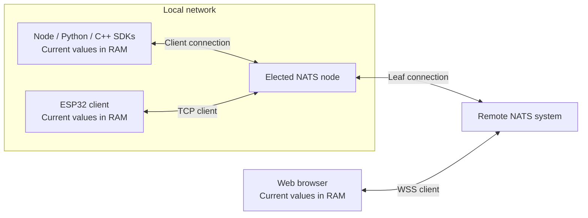

# How it works

[简体中文](architecture.zh.md) · [Home](wiki-home.en.md)

**SDKs own the current values; NATS transports updates.** Automatic nodes make a small LAN easier to connect.

In this chapter

- [A variable shared by online instances](#chapter-1)
- [Automatic LAN nodes](#chapter-2)
- [Existing servers and remote networks](#chapter-3)
- [SDK health and controls](#chapter-4)

## A variable shared by online instances

A variable is identified by **namespace + name**. Use identical names and a connected NATS topology on participating SDKs.

1. A Hub starts with empty memory and a new writer identity.
2. It asks online peers for current records and listens for updates.
3. Without a peer, a bounded lookup establishes local absence; the application can write a new value.

| Event | Result |
| --- | --- |
| `set()` or delete | Update local RAM, even while disconnected |
| Reconnect | Merge retained current records with online peers |
| New device joins | Obtain values from an online copy, if one exists |
| Page reload, process restart or last copy exits | No local restoration; surviving online peers are the only recovery source |
| `flush()` succeeds | NATS transport completed, without proving peer receipt or device execution |

### Merge and data rules

| Rule | Behavior |
| --- | --- |
| Concurrent writes | Greater logical counter wins; writer ID order breaks ties. Wall-clock time is not used. |
| Duplicate update | The same version is ignored; setting an equal value again creates a new version. |
| Delete | A versioned tombstone stays in RAM so an older copy cannot undo it. |
| Missed updates | Periodic peer queries repair current state. |
| JSON values | Null, zero and false are values; unknown and absent are separate metadata states. |
| Shared limits | Fit the receiving SDK's limits; integer-valued numbers stay within ±(2^53−1). |

> **RAM-only:** There is no history, disk persistence, cross-variable transaction or conditional update. A broker alone does not retain variables for later SDKs.

The same reference exposes [events and requests](messaging.md):

| Operation | Purpose |
| --- | --- |
| `pub/sub` | Transient JSON events |
| `req/handle` | Requests with application responses |
| Advanced messaging | JS/Python/C++: response collection, queue groups, wildcards and Headers |
| ESP32 messaging | Exact-name events and single-response requests |

Messages use separate subjects, never change the current-state record, require an active connection and have no offline replay.

## Automatic LAN nodes

Creating a **Node.js, Python or C++ Hub** enables discovery and election. Importing the package alone starts nothing; Python runs network work inside its active asyncio loop.

| Part | Rule |
| --- | --- |
| Selection | Compare reachability, latency, failure rate and host load |
| Stability | Minimum term and repeated improvement checks limit handoffs |
| Winner | Owns a plain NATS Core process; peers use its endpoint |
| Shared manager | Compatible Hubs in one process share a manager; votes group by discovered host identity |
| Domain | Group, authentication and leaf upstream settings; namespace does not create another node |
| Scale | Small IPv4 LANs; at most 32 other candidates per manager |
| Discovery | Multicast and direct control probes must be reachable |
| Ownership | The SDK stops only processes it started |

> **Availability first:** Mutually reachable members converge to one node. Partitions may elect separate nodes and briefly overlap after reconnection.

Managed LAN listeners use plaintext NATS/WS on a trusted LAN. The SDK does not install certificates or change firewalls.

Executable cache and client-only mode

- First elected startup may download a pinned, integrity-checked NATS executable.
- The cache holds the executable, never variable data.
- Supply `mesh.binary` to use an existing compatible executable.
- Set `mesh: false` for client-only operation. Browsers and ESP32 never host or vote.

## Existing servers and remote networks

*Example: an elected LAN node connects to a remote NATS system. The browser connects to that system's WSS client listener.*

| Setting | Connects to | Requirement |
| --- | --- | --- |
| `servers` | Client endpoints | Alternatives must reach the same logical NATS system |
| `mesh.upstreams` | Leaf-node endpoints | Real leaf listener; alternatives belong to one upstream system with a compatible transport mode |

SDKs can probe alternative client endpoints and switch after sustained network improvement. Selection does not connect separate NATS systems.

> **Client and leaf ports are different.** A TCP probe does not prove leaf authentication. The SDK checks actual leaf connectivity before applying an upstream-connected local node.

| Runtime | Direct client transport | Automatic node |
| --- | --- | --- |
| Node.js / Python | TCP, TLS, WS, WSS | Yes |
| Browser | WS, WSS | No |
| C++ | TCP, TLS | Yes; WS/WSS leaf upstreams run through NATS Server |
| ESP32 | TCP, TLS | No |
| ROS 2 | TCP, TLS | Inherits Python defaults; explicit servers default to client-only |

Use the [Server guide](server.md) for listener configuration and [Networking](networking.md) for connection options.

## SDK health and controls

Reports are normally sent **every five seconds**, remain in memory and exclude business values and credentials.

| Report | Contains |
| --- | --- |
| Desktop SDK | Identity, connection, health, uptime and counters |
| ESP32 | Identity, connection, health and any current error |
| `online` / `offline` | A report was seen recently / has expired |
| `unknown` | The observer is disconnected |

> **Observation is not hardware health.** SDK reports do not prove device power, application readiness or actuator completion. Namespace also provides no access control: configure NATS authentication and subject permissions.

| Control style | Completion evidence |
| --- | --- |
| Desired-state variable | A separate reported value from the device |
| Request handler | An explicit application result returned after the operation |
| [Python live](python.md#live-channels) / [ROS controls](ros.md#controls) | Their own expiry and session rules, plus application feedback |

Ordinary requests do not inherit live-channel rules. Transport acknowledgment alone never proves that an actuator completed an action.
