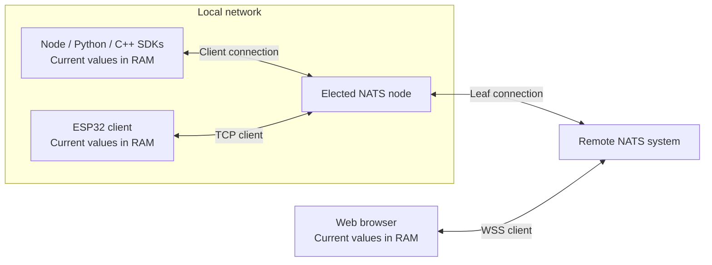

# 工作原理

[English](architecture.md) · [首页](wiki-home.md)

**SDK 保存当前值，NATS 负责传输更新。** 自动节点让小型局域网内的连接更简单。

本章目录

- [在线实例共享一个变量](#chapter-1)
- [自动局域网节点](#chapter-2)
- [已有服务器与远程网络](#chapter-3)
- [SDK 健康与控制](#chapter-4)

## 在线实例共享一个变量

变量由 **namespace + name** 确定。参与互通的 SDK 使用相同名称，并连接到连通的 NATS 拓扑。

1. Hub 从空内存和新的 writer 身份开始。
2. 向在线副本查询当前记录，同时接收更新。
3. 没有副本时，有界查询得到本地缺失结果；应用可写入新值。

| 事件 | 结果 |
| --- | --- |
| `set()` 或删除 | 更新本地 RAM，断网时也可进行 |
| 重连 | 将保留的当前记录与在线副本合并 |
| 新设备加入 | 有在线副本时，从它获取值 |
| 页面刷新、进程重启或最后一个副本退出 | 不从本地恢复；仍存活的在线副本是唯一恢复来源 |
| `flush()` 成功 | NATS 传输完成，不证明对端收到或设备执行 |

### 合并与数据规则

| 规则 | 行为 |
| --- | --- |
| 并发写入 | 逻辑 counter 较大者胜出，相同则按 writer ID 排序；不使用系统时间 |
| 重复更新 | 同一版本去重；相同值再次写入仍生成新版本 |
| 删除 | RAM 保留带版本的删除标记，防止旧副本覆盖 |
| 遗漏更新 | 周期性对等查询修复当前状态 |
| JSON 值 | null、零、false 都是值；未知与缺失由独立元数据表示 |
| 共同限制 | 满足接收 SDK 的限制；整数值位于 ±(2^53−1) |

> **仅存 RAM：** 没有历史、磁盘持久化、跨变量事务或条件更新。只保留 broker 在线，不能为后续 SDK 保存变量。

同一引用也提供[事件与请求](messaging.zh.md)：

| 操作 | 用途 |
| --- | --- |
| `pub/sub` | 瞬时 JSON 事件 |
| `req/handle` | 携带应用响应的请求 |
| 高级消息 | JS/Python/C++：多响应、队列组、通配符与 Headers |
| ESP32 消息 | 精确名称事件与单响应请求 |

消息使用独立主题，不改变当前值记录，需要有效连接，不做离线重放。

## 自动局域网节点

创建 **Node.js、Python 或 C++ Hub** 默认启用发现和选举。仅导入包不启动任何资源；Python 在运行中的 asyncio 循环内开展网络工作。

| 环节 | 规则 |
| --- | --- |
| 选择 | 比较可达性、时延、失败率和主机负载 |
| 稳定性 | 最短任期和连续改善检查减少切换 |
| 胜出者 | 托管普通 NATS Core 进程，其他实例使用其入口 |
| 共享管理 | 同进程的相容 Hub 共用管理器；按发现的主机身份汇总投票 |
| 组网域 | group、认证和 leaf 上游设置；namespace 不另建节点 |
| 规模 | 面向小型 IPv4 局域网，每个管理器最多跟踪 32 个其他候选 |
| 发现 | 组播与直接控制探测必须可达 |
| 进程归属 | SDK 只停止自己启动的进程 |

> **优先可用：** 能互相通讯的成员最终收敛为一个节点。分区可分别选举，恢复后允许短暂重叠。

托管的局域网监听使用明文 NATS/WS，适用于可信局域网。SDK 不安装证书，也不修改防火墙。

执行文件缓存与纯客户端模式

- 首次当选启动时，可能下载固定版本并校验完整性的 NATS 执行文件。
- 缓存仅保存执行文件，不保存变量数据。
- 设置 `mesh.binary` 使用已有的相容执行文件。
- `mesh: false` 选择纯客户端；浏览器与 ESP32 始终不托管、不投票。

## 现有服务器与跨网络通信

*示例：局域网选举出的节点连接远程 NATS 系统，浏览器通过该系统的 WSS 客户端入口接入。*

| 设置 | 连接对象 | 要求 |
| --- | --- | --- |
| `servers` | 客户端入口 | 备选入口通向同一逻辑 NATS 系统 |
| `mesh.upstreams` | Leaf 节点入口 | 真实 leaf 监听；备选属于同一上游系统，传输模式相容 |

SDK 可探测备选客户端入口，在网络持续改善后切换。选点不会连接原本独立的 NATS 系统。

> **客户端与 leaf 端口不同。** TCP 探测不证明 leaf 认证成功；SDK 会验证真实 leaf 连接，再应用接通上游的局域网节点。

| 运行环境 | 直接客户端传输 | 自动节点 |
| --- | --- | --- |
| Node.js / Python | TCP、TLS、WS、WSS | 支持 |
| 浏览器 | WS、WSS | 不支持 |
| C++ | TCP、TLS | 支持；WS/WSS leaf 上游由 NATS Server 处理 |
| ESP32 | TCP、TLS | 不支持 |
| ROS 2 | TCP、TLS | 沿用 Python 默认值；显式 servers 默认只做客户端 |

监听配置见 [Server 指南](server.zh.md)，连接选项见[组网](networking.zh.md)。

## SDK 状态与反向控制

报告通常**每五秒发送一次**，仅保留在内存中，不包含业务值或凭据。

| 报告 | 内容 |
| --- | --- |
| 桌面 SDK | 身份、连接、健康、运行时长与计数 |
| ESP32 | 身份、连接、健康，以及存在时的当前错误 |
| `online` / `offline` | 近期收到报告 / 报告已过期 |
| `unknown` | 观察者自身断连 |

> **观察结果不等于硬件健康。** SDK 报告不证明设备供电、应用就绪或执行器完成动作。namespace 也不提供访问控制；权限由 NATS 认证与主题规则配置。

| 控制方式 | 完成证据 |
| --- | --- |
| 期望状态变量 | 设备另外发送的报告值 |
| 请求处理函数 | 操作结束后返回明确的应用结果 |
| [Python live](python-api.zh.md#live) / [ROS 控制](ros-config.zh.md#controls) | 各自的过期与会话规则，加应用反馈 |

普通请求不继承 live 通道规则。仅凭传输确认，无法证明执行器完成了动作。
